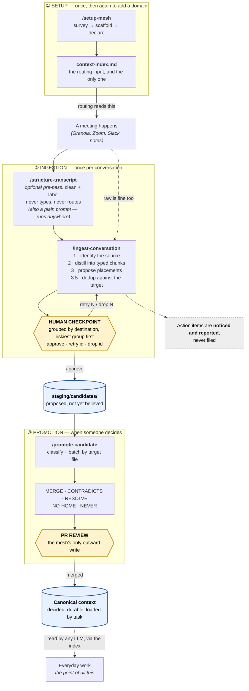
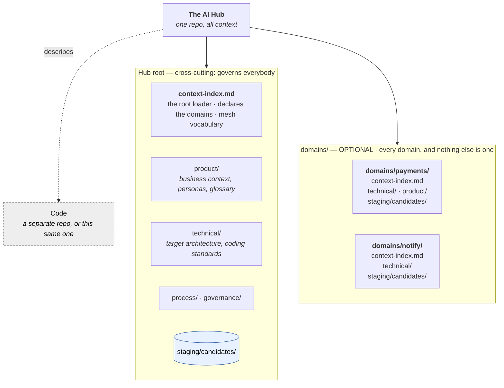

# How context-mesh works

A visual guide for humans: **what happens, in what order, and where a person has to decide
something.** For the type system see [vocabulary.md](vocabulary.md); for where files live see
[file-taxonomy.md](file-taxonomy.md). This page is the map that connects them.

Two views:

1. **[The lifecycle](#1-the-lifecycle)** — a conversation becoming durable context.
2. **[Where context lives](#2-where-context-lives)** — the shape it lands in.

---

## 1. The lifecycle

**Read it as three phases.** Setup happens once (then again per domain). Ingestion runs per
conversation. Promotion runs when someone decides a candidate is worth keeping.

**The two diamonds are the only places a human must act.** Everything else is automated, and
nothing crosses a diamond without a person saying so.

### What happens at each step

| Step | What it does | Who decides |
|---|---|---|
| **`/setup-mesh`** | Surveys the Hub, scaffolds containers, helps declare each `context-index.md`, migrates a mesh built on an older vocabulary, and reports the manifest. Idempotent — re-run it to add a domain. | A human supplies *what a file is about* and *when to load it*. A script cannot guess those. Migrations edit indexes and report; **moving content is always the human's**. |
| **`/structure-transcript`** | Optional. Turns a raw transcript into a clean, labelled one. **Cleanup and labelling only** — it never assigns a type. Also available as a plain prompt (`prompts/structure-transcript.md`) to run in any tool. | — |
| **`/ingest-conversation`** | Distils into typed chunks, proposes a placement per chunk, then dedups against the one file routing chose. The transcript itself is never modified. | — |
| **The checkpoint** | Every proposed placement, **grouped by destination file**, groups ordered by their riskiest chunk. Then it asks how you want to read them. | **You.** `approve`, `retry <id> <reason>`, or `drop <id>`. |
| **`staging/candidates/`** | Where approved candidates land. Written directly — no PR. | — |
| **`/promote-candidate`** | Classifies each candidate and batches by target file, so one document is one edit. | — |
| **The PR** | The single outward-facing gate. | **You**, plus whoever reviews. |

### Three things worth knowing

**Routing reads the index and only the index.** A file the index doesn't list is invisible —
ingestion cannot route to it. That constraint is what makes routing testable, and it is why
setup exists at all. (One exception: dedup opens *the one file routing already chose*, after
the decision is made, so it cannot influence it.)

**The checkpoint is a repair gate, not just an approve gate.** It stops the run *while the
transcript is still in context* — so `retry 3 wrong domain` is cheap. A PR would be an honest
approve gate and a dishonest repair one: fixing a bad placement by hand means re-deriving the
routing against a transcript that no longer exists. That's why staging is a direct write and
the PR sits at promotion, where existing docs get edited and concurrent changes can collide.

**"No good home" is a legal answer.** If nothing in the index fits, the run says so —
`target: null`, with a note on what file would need to exist. Forcing a fact into the nearest
surviving file is how a taxonomy rots, and the gap is a finding worth having.

---

## 2. Where context lives

One repo — the **AI Hub**. Everything is markdown, one object per file, referenced by
filesystem path.

### The two axes

Every file answers two questions, and the layout makes both unambiguous:

| | **Cross-cutting** (Hub root) | **Domain** (`domains/<name>/`) |
|---|---|---|
| **Canonical** — decided | `product/business-context.md` | `domains/payments/technical/system-behavior.md` |
| **Staging** — undecided | `staging/candidates/` | `domains/payments/staging/candidates/` |

**A domain is exactly a directory under `domains/`.** Not a thing that looks like one — the
path *is* the declaration, so nothing has to detect domain-ness. A folder called `product/` at
the root is the cross-cutting product tree; a folder called `product/` under
`domains/payments/` is that domain's. (Before v2.2 domains sat at the root and had to be
guessed at, which reported a `docs/product/` research folder as a domain while missing the real
one.)

**A domain is a namespace, not necessarily a code repository.** It may map to one repo, span
several, or be finer than one. **Which domains exist is per-engagement config**; that they own
their context exclusively, where they exist, is fixed.

**Domains are optional, and so is the Hub having a repo to itself.** Two things vary, and they
are independent of each other:

- **Zero domains is a complete mesh.** If all your context is cross-cutting — the usual case
  when there is one product to describe — there is no `domains/` directory and nothing is
  missing. The tooling will not ask you to add one.
- **The Hub may *be* the code repo.** With many repos, the Hub is usually its own and the code
  repos hold no context. **In a monorepo, the Hub root is the repo root** — `context-index.md`
  sits beside `package.json`, and Hub-relative paths are just repo-relative paths.

So a monorepo mesh is typically the top half of the diagram above and nothing else: a root
index, the cross-cutting folders, `staging/`. That is the whole structure, correctly set up.

### Canonical vs. staging

The distinction the whole system turns on:

- **Canonical** — decided facts. What the LLM should believe.
- **Staging** — proposed, contradictory, or still in play. Nothing here is believed yet.

A candidate never disappears when promoted. It stays in staging marked `state: canonical`, as
the **audit trail**: the context file states the fact, the candidate records *how we know it* —
which conversation, who raised it, when. That provenance chain is what the project exists to
preserve.

---

## What the mesh deliberately does not do

- **It does not track work.** No queues, no backlogs, no action items. A queue is the work
  itself, not context about it, and every team tracks work differently. Ingestion *notices*
  action items and reports them; filing them is yours. (This was designed and built, then
  deliberately deferred; it may return as a future feature.)
- **It does not generate context files.** Setup creates *containers* — directories and an empty
  index — never a file the index claims holds something. **An absent file is an honest gap; an
  empty listed one is a lie the tooling believes.**
- **It does not store raw transcripts** by default. It points at them where they already live.
  The exception is `source_kind: archived`, when nothing else will hold it.
- **It does not file anything outward on its own.** The PR is where the skills stop.

## Where to go next

| You want to… | Read |
|---|---|
| Understand the type system | [vocabulary.md](vocabulary.md) — start here; it is authoritative |
| Know where a given file belongs | [file-taxonomy.md](file-taxonomy.md) |
| Set a Hub up | [setup-scope.md](setup-scope.md) |
| Follow ingestion in detail | [ingestion-pipeline.md](ingestion-pipeline.md) |
