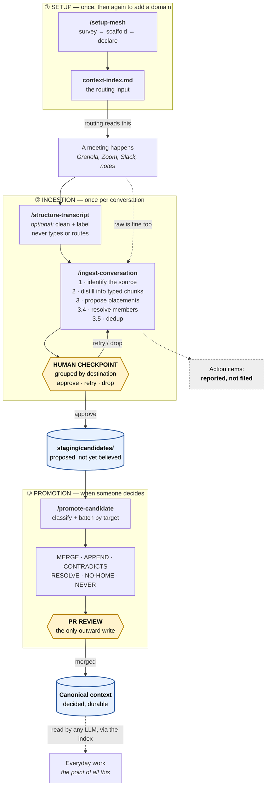
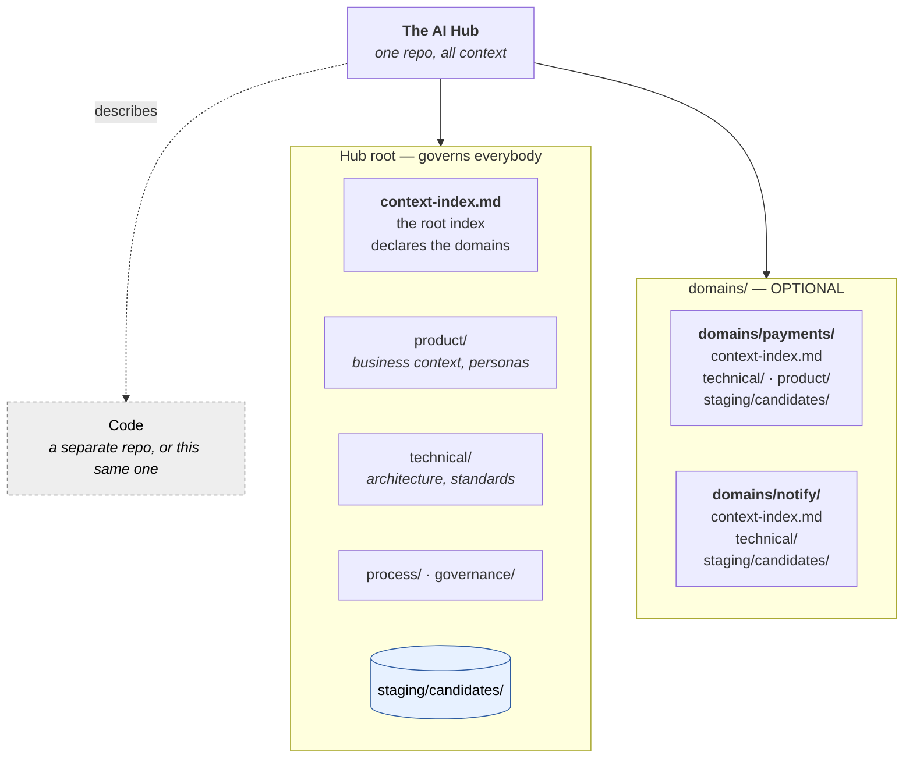

# How context-mesh works

**What this is.** The complete picture of how context-mesh works: what happens, in what order,
and where a person has to decide something.

**What you get from reading it.** You will understand the whole loop — how a conversation
becomes durable context — well enough to run it and to know what the tooling will and will not
do on its own. Start here before the other docs.

**The rest of the docs go deeper on one thing each:** [vocabulary.md](vocabulary.md) for the
types of context, [file-taxonomy.md](file-taxonomy.md) for where files live.

Below you'll find two views:

1. **[The lifecycle](#1-the-lifecycle)** — a conversation becoming durable context.
2. **[Where context lives](#2-where-context-lives)** — the shape it lands in.

---

## 1. The lifecycle

**Read it as three phases.** Setup happens once. Ingestion runs per conversation. Promotion runs
when someone decides a batch of candidates should become part of the context layer.

**There is one workflow, not one per domain.** The Hub is a single repo. Domains are just
folders inside it — another place a fact can be routed to — so ingesting a conversation that
touches three domains is still one run, one checkpoint, and one PR. Each domain has its own
index because routing needs to know what lives where, but you never run the loop three times.

**The two diamonds are the only places a human must act.** Everything else is automated, and
nothing crosses a diamond without human approval.

### What happens at each step

| Step | What it does | Who decides |
|---|---|---|
| **`/setup-mesh`** | Surveys what context the repo already has, scaffolds folders, helps declare each `context-index.md`, and lists everything the mesh tracks so you can check it. Idempotent — re-run it to add a domain. | A human supplies *what a file is about* and *when to load it*. A script cannot guess those. Migrations edit indexes and report; **moving content is always done by a human**. |
| **`/structure-transcript`** | Optional. Turns a raw transcript into a clean, labelled one. **Cleanup and labelling only** — it never assigns a type. Also available as a plain prompt (`prompts/structure-transcript.md`) to run in any tool. | — |
| **`/ingest-conversation`** | Distills into typed chunks, proposes a placement per chunk, then dedups/deconflicts against its intended target. The transcript itself is never modified. | — |
| **The checkpoint** | Every proposed placement, **grouped by destination file**, groups ordered by their riskiest chunk. Then it asks how you want to read them. | **You.** `approve`, `retry <id> <reason>`, or `drop <id>`. |
| **`staging/candidates/`** | Where approved candidates land. Written directly — no PR. | — |
| **`/promote-candidate`** | Classifies each candidate and batches by target file, so one document is one edit. | — |
| **The PR** | The single outward-facing gate. | **You**, plus whoever reviews. |

### Three things worth knowing

**Routing reads the index and only the index.** A file the index doesn't list is invisible —
ingestion cannot route to it. (Note: dedup opens and reads the chosen file once the routing choice is made.)

**The checkpoint allows re-routing, not just approval.** It stops the run *while the
transcript is still in context* — so `retry 3 wrong domain` is cheap. Staging is a direct write to create new change candidates and
the PR doesn't happen until promotion, where existing docs get edited and concurrent changes can collide.

**"No good home" is a legal answer.** If nothing in the index fits, the user is told:
`target: null`, with a note on what file would be appropriate.

---

## 2. Where context lives

One repo — the **AI Hub**. Everything is markdown, one object per file, referenced by
filesystem path.

### Two questions decide where a file goes

**Who does this govern?** Everybody, or one specific thing. **Is it decided yet?** The layout
makes both answers visible from the path alone:

| | **Everybody** (Hub root) | **One domain** (`domains/<name>/`) |
|---|---|---|
| **Decided** — canonical | `product/business-context.md` | `domains/payments/technical/system-behavior.md` |
| **Not yet decided** — staging | `staging/candidates/` | `domains/payments/staging/candidates/` |

**A domain is a directory under `domains/`. A folder called `product/` at
the root is the cross-cutting product tree; a folder called `product/` under
`domains/payments/` is specific to that domain.

**A domain is a namespace, not necessarily a code repository.** It may map to one repo, span
several, or be finer than one. **Which domains exist is your choice**; that they own their
context exclusively, where they exist, is fixed.

**Domains are optional, and so is the Hub having a repo to itself.** Two things vary independently:

- **Zero domains is a complete mesh.** If all your context is cross-cutting — the usual case
  when there is one product to describe — there is no `domains/` directory and nothing is
  missing. The tooling will not ask you to add one.
- **The Hub may *be* the code repo.** With many repos, the Hub is usually standalone and the code
  repos hold no context. **In a monorepo, the Hub root is the repo root** — `context-index.md`
  sits beside `package.json`, and Hub-relative paths are just repo-relative paths.

So a monorepo mesh is typically the top half of the diagram above and nothing else: a root
index, the cross-cutting folders, `staging/`. That is the whole structure, correctly set up.

### Three kinds of context

Context comes in three shapes. You will meet all three in a normal mesh, and picking the right
one is usually obvious once you know they exist.

**1. A single document.** One file about one subject — `technical/system-behavior.md`,
`product/business-context.md`. Most context is this type. You point at it by its path, and that is
the end of the story.

**2. A folder of documents.** Architecture decision records are the
example: `decisions/001-gcp-dev-region-us-east1.md`, `002-…`, and so on. They are all the same
kind of thing, more arrive over time, and each is its own file. We call this a **collection**. You point at the *folder*, not at any individual member.

**3. A folder of documents that reference each other.** This is a custom context type produced by the EE PM Workflow plugin (ee-pm, found in the same Claude Code marketplace as context-mesh) Some examples include
opportunities, solutions, and stories, each in its own file, each carrying an ID like
`OPP-0042`. A story says which solution it belongs to *by that ID*, so the files form a chain
you can follow. The IDs and folder names are fixed by the framework, because the chain breaks
if they move. You will likely only need this type if you use ee-pm.

**Why not list every file individually?** You could give each ADR its own row in the index, but
the index would grow forever, every new ADR would mean editing the index, and fourteen rows
would say nearly the same thing. One row for the folder is more efficient.

**So how does a new fact know which member it belongs to?** It doesn't, from the index alone —
the row describes the folder. After ingestion picks the folder, a second step looks inside it
and decides: does this modify an existing member, or create a new one? If the answer is
genuinely unclear, **it creates a new one and flags it for you at the checkpoint**, naming the
member it nearly matched. A spurious new file is easy to spot and easy to fix.

**Personas are a collection, with one thing worth knowing.** One file per persona, in a folder,
declared exactly like any other collection. But story files name a persona *by its slug*, so
**renaming a persona file breaks something; renaming an ADR does not.** That is a fact about
what your content points at, not a different kind of home — you declare both the same way.

### Canonical vs. staging

The distinction the whole system turns on:

- **Canonical** — decided facts. What the LLM should believe.
- **Staging** — proposed, contradictory, or still in play. Nothing here is yet part of the context layer.

A candidate never disappears when promoted. It stays in staging marked `state: canonical`, as
the **audit trail**: the context file states the fact, the candidate records where it came from —
which conversation, who raised it, when. That provenance chain is preserved.

---

## What the mesh deliberately does not do

- **It does not currently track work.** No queues, no backlogs, no action items. A queue is the work
  itself, not context about it, and every team tracks work differently. Ingestion *notices*
  action items and reports them. Work items may be handled in the future, however (note that we've aspirationally mentioned stories elsewhere in this document). 
- **Setup does not write context files.** It creates *containers* — folders and an empty index —
  never a file the index claims holds something. **An absent file is an honest gap; an empty
  listed one is a lie the tooling believes.** Setup can *suggest* what looks missing; it cannot
  write it, because it has nothing to write from.
- **It does not store raw transcripts** by default. It points at them where they already live.
- **It does not file anything outward on its own.** The PR is where the skills stop.

**Promotion does write files** — that is the difference. When the index declares a home that
nobody has written yet, and promotion has content for it, promotion creates it. The rule is not
"never create files"; it is **never index a file that says nothing.** Promotion has content in
hand, so the file it creates says something the moment it exists.

For collections, the same rule applies to members but not to folders: **promotion adds a member
file, and never creates the collection folder itself.** A collection row pointing at a folder
that does not exist is an error you fix, not something the tooling papers over.

## Where to go next

| You want to… | Read |
|---|---|
| Understand the types of context | [vocabulary.md](vocabulary.md) |
| Know where a given file belongs | [file-taxonomy.md](file-taxonomy.md) |
| Set a mesh up | Run `/setup-mesh` — it walks you through it |
